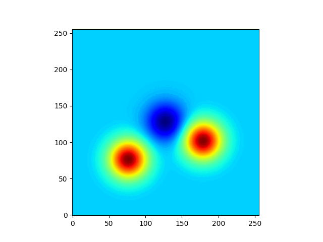

Unpack [Basilisk](https://basilisk.fr) and enter the source directory:
```
wget -q http://basilisk.fr/basilisk/basilisk.tar.gz
tar zxf basilisk.tar.gz
cd basilisk/src
```

On Linux use:
```
cp config.gcc config
```

On macOS use:
```
cp config.osx config
```

Build and install `qcc`
```
make ast && make qcc
mkdir -p "$HOME/.local/bin"
cp qcc "$HOME/.local/bin/"
```

Build `vortex`:
```
qcc -disable-dimensions main.c -O2 -lm -o vortex
```

Run with one or more vortices; each vortex is three numbers: `x y omg`. Domain is `[0,1] x [0,1]`; strength `omg` can be negative.
```
./vortex 0.3 0.3 1.0  0.5 0.5 -0.5  0.7 0.4 1.0
```

`main.c` writes per-snapshot raw fields to `a.*.attr.raw`; `omega` is the first field in each record.
`post.py` reads these files, writes per-snapshot images `a.*.png`, and creates `omegas.npy` with shape `(nsnap, n, n)`.

Generate PNG frames:
```
python post.py
```

Create an animation with [ImageMagick](https://imagemagick.org), command can be `convert` in older versions:
```
magick a.*.png img/a.gif
```

## Batch runs

Generate random vortex configurations (10 directories `00000000/` through `00000009/`, each with an `args` file):
```
python gen.py
```

Run all cases in parallel with post-processing:
```
sh run.sh
```

`run.sh` skips directories that already have a `status` file, so it is safe to re-run after failures.

## Ellipses

Build and run `ellipses`:
```
qcc -disable-dimensions ellipses.c -O2 -lm -o ellipses
./ellipses \
   0.5 0.65 1 0.15 0.035 0 \
   0.5 0.35 1 0.15 0.035 0 \
   0.65 0.5 1 0.035 0.15 0 \
   0.35 0.5 1 0.035 0.15 0
```

<p align="center">
  
</p>
